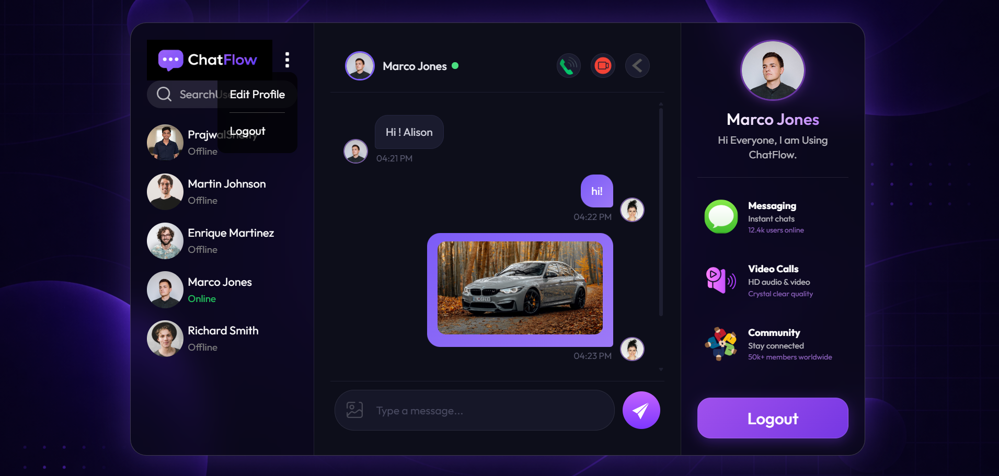

# 💬 ChatFlow

### Real-Time Communication Platform

Connect • Chat • Share • Call

 

---

## 📌 About The Project

ChatFlow is a modern real-time communication platform that enables users to connect through instant messaging, image sharing, video sharing, and audio/video calling.

The platform uses Socket.IO for real-time messaging and WebRTC for peer-to-peer audio and video communication.

---

## ✨ Features

* User Registration
* User Login
* User Logout
* JWT Authentication
* Real-Time Messaging
* Online/Offline User Status
* Image Sharing
* Video Sharing
* Audio Calling
* Video Calling
* Message Timestamps
* Responsive User Interface

---

## 🔗 Built With

* React.js
* Node.js
* Express.js
* MySQL
* Socket.IO
* WebRTC
* JWT

---

## 📸 Application Preview

  

